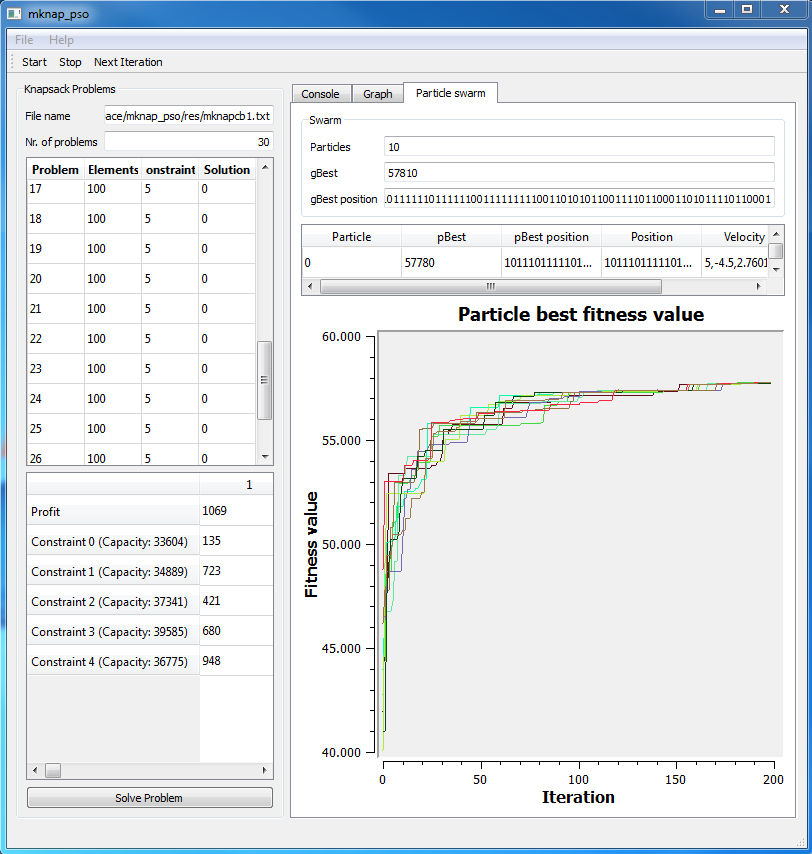

### Implementation of the Particle Swarm Optimization algorithm for the multi-dimensional knapsack problem

This application solves the multidimensional Knapsack Problem from OR Library with the discrete version of particle swarm optimization.

It uses Qt for the GUI and qwt for the plots.
For further information: [documentation](doc/elaboration.tex)

Problem files:  
http://people.brunel.ac.uk/~mastjjb/jeb/orlib/files/mknapcb1.txt

#### Build mknap_pso
To build mknap_pso you need Qt 5, qwt and a C++11 compiler. A CMakeLists.txt file is provided.
